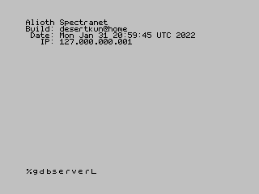

# spectranet-gdbserver

A Hardware Debugger stub for your ZX Spectrum.

It allows you to debug speccy on "C" level with help of
[z88dk-gdb](https://github.com/z88dk/z88dk).

It requires [Spectranet](https://www.bytedelight.com/?page_id=3515) because it operates over the network.

# Emulation

Despite Spectranet requirement, it can be run on
[Fuse for win](https://github.com/speccytools/fuse/releases/latest) or [FuseX for mac](https://github.com/speccytools/fuse-for-macosx/releases/latest) emulator.
Note that the link refers to fork that supports gdbserver stub on its own,
so for emulation with Fuse this might be unnecessary.

# Installation

Spectranet releases past `R1002` already have this module preinstalled.

# How does it work?

It's a Spectranet module, once installed, 
a BASIC extension `%gdbserver` becomes available.

1. When such command is run, it overrides NMI button handler. 
2. When NMI is pressed, it takes over and awaits for z88dk-gdb to connect.
The NMI button could be pressed mid-execution of your program to examine stuff.
3. z88dk-gdb can do pretty much anything expected from a gdb-alike client.

# How To Build Form Source

Have z88dk installed, and then do `make`. 

1. Download ethup tool for [linux](https://github.com/speccytools/spectranet-gdbserver/raw/master/tools/linux/ethup),
   [mac](https://github.com/speccytools/spectranet-gdbserver/raw/master/tools/mac/ethup),
   [win32](https://github.com/speccytools/spectranet-gdbserver/raw/master/tools/win32/ethup.exe), if you haven't already.
2. Launch your spectrum (with spectranet), press the NMI button
3. Select "B", then select "B" (replace) and Enter number of existing gdbserver module (for example, 9)
4. Upload the binary using ethup: `ethup <spectrum ip> build/gdbserver__.bin`
5. Restart spectrum

Done, you can launch the gdbserver using basic `%gdbserver` command.

Seeing an error? Make sure you've upgraded your spectranet first to at least `R1002` revision!

# Limitations

1. You can not place a breakpoint on read-only memory
2. Programs that use Spectranet need to use non-paging version, e.g. page in and page out every time Spectranet functions are needed.
   Otherwise, breakpoints will only work one time and would need to be placed again after each break, if Spectranet is always paged in. 
3. 128K mode is not supported yet.

# Screenshots

 

